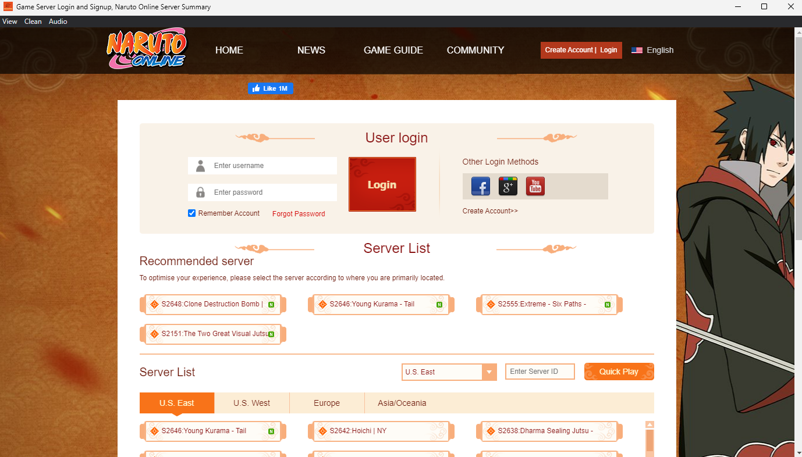
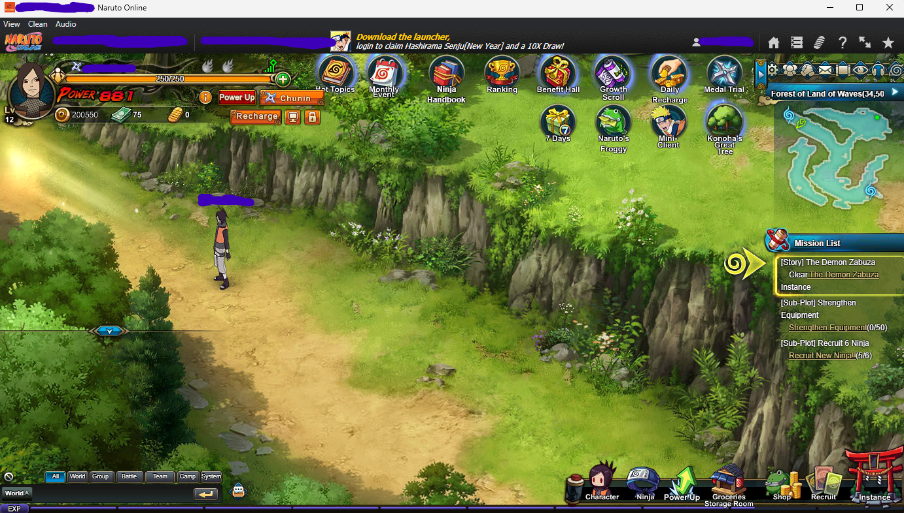

# Naruto Online Browser

Unofficial solution to play Naruto Online in browser which works on most platforms.

- Download for Windows 32-bit: [118 MB](https://github.com/glennhenry/Naruto-Online-Browser/releases/download/v1.0.0/Naruto.Online.Browser-win32.zip)
- Download for Windows 64-bit: [125 MB](https://github.com/glennhenry/Naruto-Online-Browser/releases/download/v1.0.0/Naruto.Online.Browser-win32-x64.zip)
- Download for macOS ARM 64: [268 MB](https://github.com/glennhenry/Naruto-Online-Browser/releases/download/v1.0.0/Naruto.Online.Browser-darwin-arm64.zip)
- Download for macOS 64-bit: [260 MB](https://github.com/glennhenry/Naruto-Online-Browser/releases/download/v1.0.0/Naruto.Online.Browser-darwin-x64.zip)
- Download for Linux 64-bit: [111 MB](https://github.com/glennhenry/Naruto-Online-Browser/releases/download/v1.0.0/Naruto.Online.Browser-linux-x64.zip)

The app is minimal wrapper around an older Chromium build that still supports Flash content. It is not a full browser — its only purpose is to open and run the Naruto Online webpage.

It's intended to be the “last resort” solution to play Naruto Online if nothing else works:

- Mini client don't work smoothly.
- Not on Windows (mini client unavailable)
- Couldn't find any other Flash browser.

Based on an old [Electron](https://www.electronjs.org/) build (v11.5) which uses Chromium v87.0.4280.141, it works similar to another [FlashBrowser](https://github.com/radubirsan/FlashBrowser).

### Limitations

- Security risk: Since it uses an outdated browser version, vulnerabilities may exist. Risks are reduced if you only use it for Naruto Online. In the Linux platform, it uses `--no-sandbox`.
- Limited features: It doesn't have features like bookmark, extensions, multi tabs (only multi windows), and other advanced browser features.
- Doesn't save account: You need to enter account every time you open the app.
- Doesn't support multiple account: You will need to login-logout for each different account you use.

### Features

- Lightweight: It only loads Naruto Online webpage and that's it.
- Mute: You can mute the game per-window (no volume slider).
